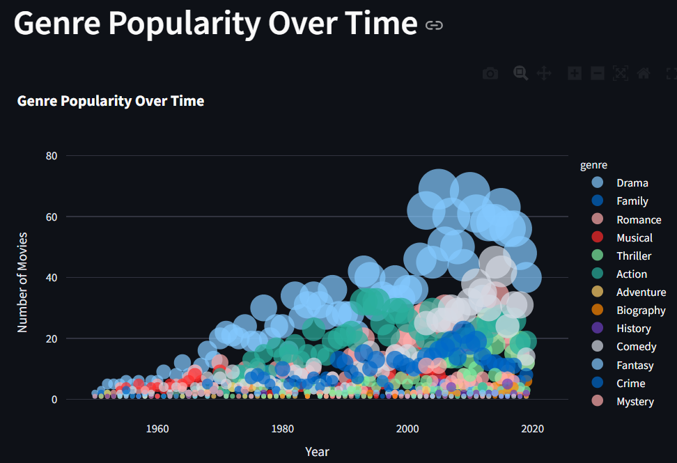
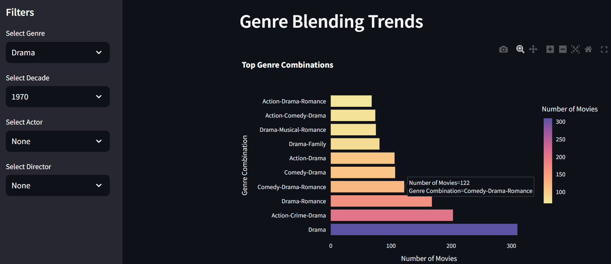
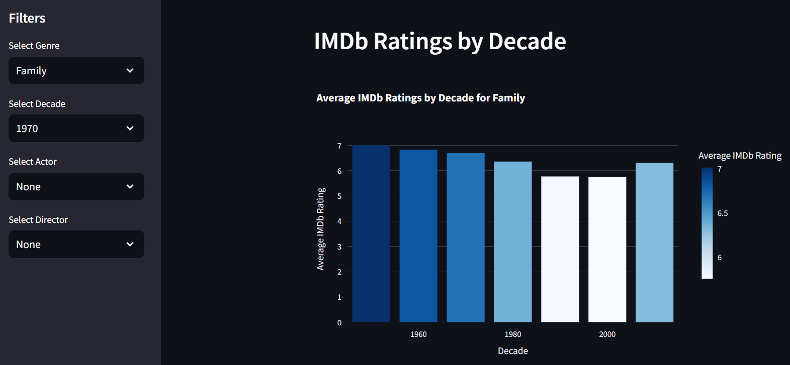

# 🎬 Bollywood Movie Trends & Collaborations (1950–2019)

This interactive dashboard explores seven decades of Bollywood cinema — analyzing genre evolution, actor-director collaborations, IMDb ratings, and award patterns. Built using **Streamlit**, **Plotly**, and **NetworkX**, this project enables dynamic exploration of rich, preprocessed movie datasets, empowering users with insights into India’s largest film industry.

---

## 📊 Key Features

- 📈 **Genre Popularity Over Time** using dynamic bubble charts  
- 🎭 **Genre Blending Trends** reveal top "masala" genre combinations  
- ⭐ **IMDb Ratings by Decade** helps identify Bollywood's golden eras  
- 🤝 **Actor-Director Collaboration Network** to analyze creative duos  
- 📊 **Genre Distribution** for specific actor-director pairs  
- 🏆 **Top Collaborations by Awards and IMDb Ratings**  
- 🎛️ Interactive filtering by Genre, Actor, Director, Year, and Top-N

---

## 🗂️ Project Structure
Bollywood-Movie-Analysis/
├── movie_actor_director.py # Streamlit dashboard script
├── genre_timeline.csv # Genre popularity over time
├── ratings_by_decade.csv # IMDb ratings grouped by decade
├── genre_blending.csv # Genre combination frequency
├── merged_actor_director_data.csv # Actor-director collaboration dataset
├── bollywood_full_preprocessed_split.csv # Cleaned base dataset
├── genra_popualrity_time_streamlit.png # Screenshot - Genre popularity bubble chart
├── Genre_blending_trends_streamlit.png # Screenshot - Genre blending bar chart
├── IMDB_Rating_decade_streamlit.png # Screenshot - IMDb ratings by decade
├── CTRL_Freaks_Movie_Analysis_Final_Report.pdf # Project report
├── Dataset_Preprocessing.ipynb # Data cleaning notebook
└── README.md


---

## 🖼️ Visual Previews

### 📈 Genre Popularity Over Time
Bubble chart visualizing dominant genres by year from 1950 to 2019.  


---

### 🎭 Genre Blending Trends (Masala Films)
Top combinations like Drama-Romance and Action-Drama that shaped mainstream cinema.  


---

### ⭐ IMDb Ratings by Decade
Track audience appreciation trends across decades.  


---

## 📚 Report & Research

A detailed research report outlining the methodology, data processing, visual design, and insights is available:  
📄 [`CTRL_Freaks_Movie_Analysis_Final_Report.pdf`](CTRL_Freaks_Movie_Analysis_Final_Report.pdf)

---

## 🚀 Running the Dashboard

### 🧰 Step 1: Install Dependencies

```bash
pip install streamlit pandas plotly networkx
```

### ▶️ Step 2: Launch Locally

```bash
streamlit run movie_actor_director.py
```
## 🎛️ Interactive Filters

The dashboard allows you to:

- Select **Genre(s)** (e.g., Drama, Action, Comedy)
- Choose a **Year Range** (1950–2019)
- Pick **Actor** and **Director** combinations
- Set **Top-N Collaboration Count** for visualizations

---

## 📊 Visualization Breakdown

| Visualization         | Description                                                  |
|------------------------|--------------------------------------------------------------|
| 📈 **Genre Timeline**   | Bubble chart showing genre trends over time                  |
| 🧬 **Genre Blending**   | Bar chart of top genre combinations (masala films)           |
| ⭐ **IMDb Ratings**     | Bar chart comparing average ratings by decade                |
| 🤝 **Collab Network**   | Interactive network graph of top actor-director duos         |
| 🏆 **Wins by Pair**     | Horizontal bar chart of duos with the most awards            |
| 🥧 **Genre by Pair**    | Pie chart showing genre preferences by collaboration         |
| 🎯 **Ratings by Pair**  | Scatter plot comparing average IMDb and frequency            |

---

## 📈 Key Insights

- **Drama** and **Action** are the most consistently dominant genres.
- **Masala Films** (blended genres) like *Drama-Romance* and *Action-Comedy* are prevalent.
- The **1960s–1970s** were Bollywood’s golden era in IMDb ratings.
- Frequent actor-director duos such as **Boman Irani – Rajkumar Hirani** and **Anupam Kher – David Dhawan** top the charts in wins and collaborations.
- Genre blending helped broaden appeal and award potential post-2000.

---

## 🌐 Live Dashboards

Explore the app live (if deployed):

- 🔗 **[Genre Trends & Ratings Dashboard](https://data-viz-movie-analysis-shreya-vaishnavi.streamlit.app/)**
- 🔗 **[Actor-Director Collaboration Dashboard](https://data-viz-movie-analysis-actor-director-shreya-vaishnavi.streamlit.app/)**

---

## 📌 Datasets

- `genre_timeline.csv` – Year-wise count of movies by genre  
- `ratings_by_decade.csv` – Average IMDb ratings by decade  
- `genre_blending.csv` – Frequency of genre combinations  
- `merged_actor_director_data.csv` – Actor-director link data  
- `bollywood_full_preprocessed_split.csv` – Master dataset with genre and cast split  

> All datasets were cleaned and preprocessed using `Dataset_Preprocessing.ipynb`.

